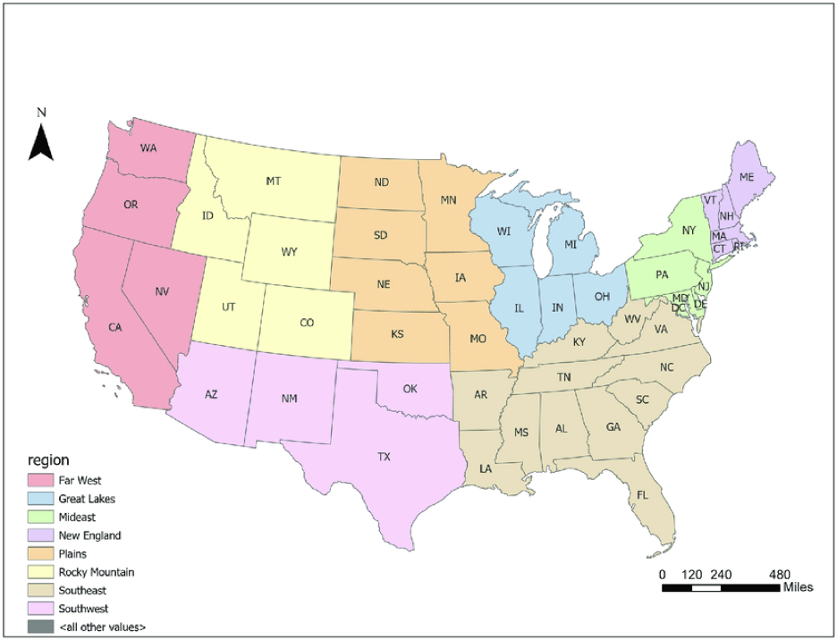

```{r}
# Set the working directory
setwd("/Users/dreamer/Downloads/Godaddy/godaddy_microbusiness_forecasting")
```

```{r}
# Importing the libraries
library(mice)
library(ggplot2)
library(gridExtra)
library(dplyr)
library(caret)
library(gbm)
#library(png)
#library(ggmap)
library(viridis)
library(mapdata)

# Code starts here
```

### Exploring the datasets

Explore the datasets to get a better understanding of the data.\
Load the train and test datasets into dataframes.

```{r}
# Load train.csv into a dataframe
train_df <- read.csv("./datasets/train.csv")

# Load test.csv into a dataframe
test_df <- read.csv("./datasets/test.csv")

# Load census_starter.csv into a dataframe
census_df <- read.csv("./datasets/census_starter.csv")

```

Check the dataframes

After reading the CSV files into dataframes, we should check whether the data is loaded correctly or not. We can use the head() function of R to display the first few rows of the dataframes and tail() function to display the last rows. This will display the first and last 10 rows of the train, test and census dataframes. We can also use other pandas functions such as info() and describe() to get more information about the dataframes, such as column names, data types, and summary statistics.

```{r}
# Display the first 10 rows of the dataframes
head(train_df, n = 10)
head(test_df, n = 10)
head(census_df, n = 10)

```

```{r}
# Display the last 10 rows of the dataframes
tail(train_df, n = 10)
tail(test_df, n = 10)
tail(census_df, n = 10)
```

```{r}
# Display information about the train dataframe
str(train_df)
cat(rep("=", 40), "\n") # Print a line of 40 equal signs
summary(train_df)
```

```{r}
# Display information about the test dataframe
str(test_df)
cat(rep("=", 40), "\n") # Print a line of 40 equal signs
summary(test_df)
```

```{r}
# Display information about the census dataframe
str(census_df)
cat(rep("=", 40), "\n") # Print a line of 40 equal signs
summary(census_df)
```

The is.na() function is used to create a logical matrix where TRUE represents a missing value and FALSE represents a non-missing value. The colSums() function is then used to count the number of missing values in each column of the data frame. If the sum of a column is greater than 0, it means that there is at least one missing value in that column.

```{r}
# Check for missing values in the train data frame
colSums(is.na(train_df))
```

```{r}
# Check for missing values in the test data frame
colSums(is.na(test_df))
```

```{r}
# Check for missing values in the census data frame
colSums(is.na(census_df))
```

We use the complete.cases() function to determine which rows have complete data and which rows have missing values. The complete.cases() function returns a logical vector indicating which rows have no missing values. Therefore, to identify the rows with missing values, we use the ! operator to negate the logical vector returned by complete.cases(). Then, we use the is.na() function to identify which columns have missing values for each missing row:

```{r}
# Identify rows with missing values in census_df
missing_rows <- which(!complete.cases(census_df))
```

```{r}
# Identify columns with missing values for each missing row
for (i in missing_rows) {
  cat("Row", i, "has missing values in columns:",
      paste(names(census_df)[is.na(census_df[i,])], collapse = ", "), "\n")
}
print(census_df[missing_rows,])

```

We use the mice package to impute missing values in the census_df dataframe.

m: the number of imputations to generate was set to 5, because, generally, m should be set to at least 5 for good imputation performance. creating too many datasets will increase the computational cost and may not necessarily lead to better results.

maxit: maxit was set to 50 to allow for a larger number of iterations to ensure that the imputation algorithm converges and fills in missing values as accurately as possible.

method: In this case, we are using "pmm" which stands for "Predictive Mean Matching", because it is a flexible and widely used imputation method that works well with continuous variables. The method estimates the missing values by drawing from a set of observed values that have similar characteristics to the missing values.

```{r}
# Impute missing data using mice
imputed_df <- mice(census_df, m = 5, maxit = 50, method = "pmm")
```

```{r}
# Extract imputed data
imputed_data <- complete(imputed_df)

# Check for missing values in imputed data
colSums(is.na(imputed_data))

```

```{r}
print(imputed_data[missing_rows,])
```

```{r}
index <- unique(train_df$first_day_of_month)
print(index)
```

training data is from 08/2019 to 10/2022

```{r}
index <- unique(test_df$first_day_of_month)
print(index)
```

prediction dates are from 11/2022 to 06/2023

## EDA

To make analysis easier and be able to group the data by year and month, we'll extract year and month values from the first_day_of_month column in both train and test dataframes using apply() method and lambda function, and then create new columns called year (int), month (int), and year_month (str) in each dataframe to store these values.

```{r}
# Add year, month and year_month columns to train_df
train_df$year <- as.integer(substr(train_df$first_day_of_month, 1, 4))
train_df$month <- as.integer(substr(train_df$first_day_of_month, 6, 7))
train_df$year_month <- substr(train_df$first_day_of_month, 1, 7)

# Add year, month and year_month columns to test_df
test_df$year <- as.integer(substr(test_df$first_day_of_month, 1, 4))
test_df$month <- as.integer(substr(test_df$first_day_of_month, 6, 7))
test_df$year_month <- substr(test_df$first_day_of_month, 1, 7)
```

```{r}
str(train_df)
cat(rep("=", 40), "\n")
str(test_df)
```

```{r}
# Group train_df by year_month and calculate the mean value of microbusiness_density for each group
train_df_mean <- train_df %>%
  group_by(year_month) %>%
  summarise(mean_microbusiness_density = mean(microbusiness_density))

# Create plot
ggplot(train_df_mean, aes(x = year_month, y = mean_microbusiness_density, group = 1)) +
  geom_line() +
  labs(title = "Overall Average Microbusiness Density",
       x = "Year-Month",
       y = "Average Microbusiness Density") +
  theme(axis.text.x = element_text(angle = 45, hjust = 1))

```

```{r}
# Group train_df by year and calculate the mean value of microbusiness_density for each group
train_df_mean_year <- train_df %>%
  group_by(year) %>%
  summarize(avg_microbusiness_density = mean(microbusiness_density))

# Group train_df by month and calculate the mean value of the target variable for each group
train_df_mean_month <- train_df %>%
  group_by(month) %>%
  summarize(avg_microbusiness_density = mean(microbusiness_density))

# Plot the monthly mean values
p1 <- 
  ggplot(train_df_mean_month, aes(x = month, y = avg_microbusiness_density)) +
  geom_line() +
  ggtitle("Avg Monthly Microbusiness Density") +
  xlab("Month") +
  ylab("Average Microbusiness Density") +
  theme(axis.text.x = element_text(angle = 45, hjust = 1))

# Plot the yearly mean values
p2 <- 
  ggplot(train_df_mean_year, aes(x = year, y = avg_microbusiness_density)) +
  geom_line() +
  ggtitle("Avg Yearly Microbusiness Density") +
  xlab("Year") +
  ylab("Average Microbusiness Density") +
  theme(axis.text.x = element_text(angle = 45, hjust = 1))

# Display the plots side by side
grid.arrange(p1, p2, ncol=2)
```

The Bureau of Economic Analysis (BEA) divides the United States into eight distinct economic regions. These regions are based on similarities in economic characteristics such as industry composition, income levels, and employment patterns. The eight regions are:

1.  New England: Connecticut, Maine, Massachusetts, New Hampshire, Rhode Island, and Vermont.

    The economy in this region is largely based on manufacturing, healthcare, education, and finance.

2.  Mideast: Delaware, Maryland, New Jersey, New York, Pennsylvania, and the District of Columbia.

    The region has a diverse economy, with a mix of manufacturing, finance, healthcare, and professional services.

3.  Great Lakes: Illinois, Indiana, Michigan, Ohio, and Wisconsin.

    The region has a strong manufacturing base, particularly in the automotive industry, and also has a significant healthcare sector.

4.  Plains: Iowa, Kansas, Minnesota, Missouri, Nebraska, North Dakota, and South Dakota.

    Agriculture and energy production are major industries in this region, along with manufacturing and healthcare.

5.  Southeast: Alabama, Arkansas, Florida, Georgia, Kentucky, Louisiana, Mississippi, North Carolina, South Carolina, Tennessee, Virginia, and West Virginia.

    The Southeast has a diverse economy, with significant industries in healthcare, finance, and manufacturing, as well as tourism and agriculture.

6.  Southwest: Arizona, New Mexico, Oklahoma, and Texas.

    The region has a strong energy sector, particularly in oil and gas production, and also has significant industries in manufacturing, healthcare, and finance.

7.  Rocky Mountain: Colorado, Idaho, Montana, Utah, and Wyoming.

    The region is known for its natural resources, particularly in mining and energy production, as well as tourism, healthcare, and manufacturing.

8.  Far West: Alaska, California, Hawaii, Nevada, Oregon, and Washington.

    This region has a diverse economy, with significant industries in technology, finance, healthcare, and manufacturing, as well as tourism and agriculture.



```{r}
# Create a new column named region and initialize all values as NA
train_df$region <- NA

# Assign region values based on state column
for (i in 1:nrow(train_df)) {
  if (train_df$state[i] %in% c("Connecticut", "Maine", "Massachusetts", "New Hampshire", "Rhode Island", "Vermont")) {
    train_df$region[i] <- 1 # New England
  } else if (train_df$state[i] %in% c("Delaware", "Maryland", "New Jersey", "New York", "Pennsylvania", "District of Columbia")) {
    train_df$region[i] <- 2 # Mideast
  } else if (train_df$state[i] %in% c("Illinois", "Indiana", "Michigan", "Ohio", "Wisconsin")) {
    train_df$region[i] <- 3 # Great Lakes
  } else if (train_df$state[i] %in% c("Iowa", "Kansas", "Minnesota", "Missouri", "Nebraska", "North Dakota", "South Dakota")) {
    train_df$region[i] <- 4 # Plains
  } else if (train_df$state[i] %in% c("Alabama", "Arkansas", "Florida", "Georgia", "Kentucky", "Louisiana", "Mississippi", "North Carolina", "South Carolina", "Tennessee", "Virginia", "West Virginia")) {
    train_df$region[i] <- 5 # Southeast
  } else if (train_df$state[i] %in% c("Arizona", "New Mexico", "Oklahoma", "Texas")) {
    train_df$region[i] <- 6 # Southwest
  } else if (train_df$state[i] %in% c("Colorado", "Idaho", "Montana", "Utah", "Wyoming")) {
    train_df$region[i] <- 7 # Rocky Mountain
  } else if (train_df$state[i] %in% c("Alaska", "California", "Hawaii", "Nevada", "Oregon", "Washington")) {
    train_df$region[i] <- 8 # Far West
  } else train_df$region[i] <- 0
}

```

```{r}
# Print all the unique values in the region column
unique(train_df$region)
```

```{r}
# Group train_df by Region and calculate the mean value of microbusiness_density for each group
train_df_mean_region <- train_df %>%
  group_by(region) %>%
  summarize(avg_microbusiness_density = mean(microbusiness_density))


# Plot the monthly mean values
ggplot(train_df_mean_region, aes(x = region, y = avg_microbusiness_density)) +
geom_line() +
ggtitle("Average Microbusiness Density Per Region") +
xlab("Region") +
ylab("Average Microbusiness Density")
```

```{r}
# Group train_df by year and calculate the mean value of microbusiness_density for each group
train_df_mean_year <- train_df %>%
  group_by(year) %>%
  summarize(avg_microbusiness_density = mean(microbusiness_density))

# Group train_df by month and calculate the mean value of the target variable for each group
train_df_mean_month <- train_df %>%
  group_by(month) %>%
  summarize(avg_microbusiness_density = mean(microbusiness_density))

# Plot the monthly mean values
p1 <- 
  ggplot(train_df_mean_month, aes(x = month, y = avg_microbusiness_density)) +
  geom_line() +
  ggtitle("Avg Monthly Microbusiness Density") +
  xlab("Month") +
  ylab("Average Microbusiness Density") +
  theme(axis.text.x = element_text(angle = 45, hjust = 1))

# Plot the yearly mean values
p2 <- 
  ggplot(train_df_mean_year, aes(x = year, y = avg_microbusiness_density)) +
  geom_line() +
  ggtitle("Avg Yearly Microbusiness Density") +
  xlab("Year") +
  ylab("Average Microbusiness Density") +
  theme(axis.text.x = element_text(angle = 45, hjust = 1))

# Display the plots side by side
grid.arrange(p1, p2, ncol=2)
```

```{r}
# Aggregate the data by state to calculate the average Microbusiness Density per state
avg_microbusiness_density <- train_df %>%
  group_by(state) %>%
  summarize(avg_microbusiness_density = mean(microbusiness_density))

# Get a map of the US
us_map <- map_data("state")

# Convert state names to uppercase to match the data
us_map$region <- toupper(us_map$region)

# Merge the aggregated data with the US map
us_map_with_data <- left_join(us_map, avg_microbusiness_density, by = c("region" = "state"))

# Create the heatmap plot
ggplot(us_map_with_data) +
  geom_polygon(aes(x = long, y = lat, group = group, fill = avg_microbusiness_density)) +
  scale_fill_gradient(low = "white", high = "red") +
  ggtitle("Average Microbusiness Density per State") +
  labs(fill = "Microbusiness Density") +
  theme_void()

```

```{r}
# Read in the shapefile of the US
us_map <- st_read("cb_2019_us_state_20m.shp")

# Aggregate the data by region to calculate the average Microbusiness Density per region
avg_microbusiness_density <- train_df %>%
  group_by(region) %>%
  summarize(avg_microbusiness_density = mean(microbusiness_density))

# Merge the aggregated data with the shapefile of the US
us_map_with_data <- left_join(us_map, avg_microbusiness_density, by = c("BEA_Region" = "region"))

# Create the heatmap plot
ggplot(us_map_with_data) +
  geom_sf(aes(fill = avg_microbusiness_density)) +
  scale_fill_gradient(low = "white", high = "red") +
  ggtitle("Average Microbusiness Density per BEA Region") +
  labs(fill = "Microbusiness Density") +
  theme_void()

```

```{r}
library(ggplot2)
library(dplyr)
library(ggmap)
library(viridis)

# Load the data with region column
data <- read.csv("data.csv")

# Calculate the average Microbusiness Density per region
avg_density <- data %>%
  group_by(region) %>%
  summarize(avg_density = mean(microbusiness_density))

# Get the coordinates of the regions using ggmap library
us_map <- get_map(location = "United States", zoom = 4, maptype = "terrain")
region_coords <- data.frame(region = unique(data$region))
region_coords <- mutate(region_coords, lon = NA, lat = NA)

for(i in 1:nrow(region_coords)) {
  region_coords$lat[i] <- mean(data$lat[data$region == region_coords$region[i]])
  region_coords$lon[i] <- mean(data$lon[data$region == region_coords$region[i]])
}

# Merge the average density and region coordinates data
map_data <- left_join(avg_density, region_coords, by = "region")

# Create the heatmap plot
ggmap(us_map) +
  geom_point(data = map_data, aes(x = lon, y = lat, color = avg_density), size = 6, alpha = 0.8) +
  scale_color_viridis(name = "Avg. Microbusiness Density", option = "plasma", trans = "log10") +
  labs(title = "Average Microbusiness Density Per Region", subtitle = "Data source: data.csv", color = "") +
  theme(plot.title = element_text(size = 20, face = "bold", margin = margin(b = 10)),
        plot.subtitle = element_text(size = 14, margin = margin(b = 20)),
        legend.title = element_text(size = 16),
        legend.text = element_text(size = 14))

```

```{r}
# Sample data for Microbusiness Density and region names
micro_density <- data.frame(region = c("Northeast", "Midwest", "South", "West"),
                            density = c(50, 75, 100, 125))

# Sample data for region latitude and longitude
region_coords <- data.frame(region = c("Northeast", "Midwest", "South", "West"),
                            lon = c(-71.7182, -93.5815, -89.0022, -119.4179),
                            lat = c(42.0324, 41.6005, 31.9686, 36.7783))

# Merge datasets based on region names
micro_coords <- merge(micro_density, region_coords, by = "region")

# Create US map
us_map <- map_data("state")

# Create heatmap
heatmap <- ggplot(micro_coords, aes(x = lon, y = lat, fill = density)) +
           geom_tile() +
           scale_fill_gradient(low = "white", high = "red")

# Overlay heatmap onto US map
heatmap_on_map <- heatmap + 
                   geom_path(data = us_map, aes(x = long, y = lat, group = group), color = "black", alpha = 0.5) +
                   coord_fixed(xlim = range(micro_coords$lon), ylim = range(micro_coords$lat), ratio = 1.3)

# Display plot
heatmap_on_map

```

```{r}
df_avg <- train_df %>% 
  group_by(region) %>% 
  summarise(avg_microbusiness_density = mean(microbusiness_density))

```

```{r}
df_map <- merge(map_data("county"), df_avg, by.x = "subregion", by.y = "region")
```

```{r}
ggplot(df_map, aes(x = long, y = lat, group = group, fill = avg_microbusiness_density)) +
  geom_polygon() +
  scale_fill_gradient(low = "white", high = "red") +
  coord_map() +
  theme_void()
```

```{r}
library(maps)
library(mapdata)

# Aggregate data by region and calculate the mean microbusiness density
region_means <- aggregate(microbusiness_density ~ region, data = train_df, FUN = mean)

# Create a US map
map("state", fill = TRUE, col = "white", bg = "lightblue")

# Add the regions with the mean microbusiness density as the fill color
points(subset(mapdata, region_means$region == region), 
       col = heat.colors(length(region_means$region))[region_means$microbusiness_density], 
       pch = 15, cex = 2)

```

```{r}
library(maps)
library(mapdata)

# Create a new variable that maps the region number to region name
train_df$region_name <- ifelse(train_df$region == 1, "New England",
                           ifelse(train_df$region == 2, "Mideast",
                             ifelse(train_df$region == 3, "Great Lakes",
                               ifelse(train_df$region == 4, "Plains",
                                 ifelse(train_df$region == 5, "Southeast",
                                   ifelse(train_df$region == 6, "Southwest",
                                     ifelse(train_df$region == 7, "Rocky Mountain", "Far West")))))))


# Aggregate data by region and calculate the mean microbusiness density
region_means <- aggregate(microbusiness_density ~ region_name, data = train_df, FUN = mean)

# Create a US map
map("state", fill = TRUE, col = "white", bg = "lightblue")

# Add the regions with the mean microbusiness density as the fill color
points(subset(mapdata, mapdata$region %in% region_means$region_name), 
       col = heat.colors(length(region_means$region_name))[region_means$microbusiness_density], 
       pch = 15, cex = 2)

```
